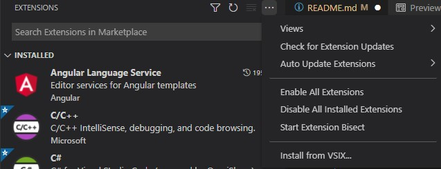

# vs-codex README

VS Codex AI generated auto-completions

## Features

* Autocompletes your code in most programming languages.
* You can select which part of your code to send as a prompt.
* Smart prompt generation for javascript, typescript, c/c++, C#, java and python.

## Requirements

* Requires an OpenAI API key with access to the Codex model.
* VS Code insiders: <https://code.visualstudio.com/insiders/>

## Installation
1. Download the latest VSIX from Github or compile this source code.  
0. Open VS Code insiders.
3. Go to the extensions tab.
4. Install from VSIX.

